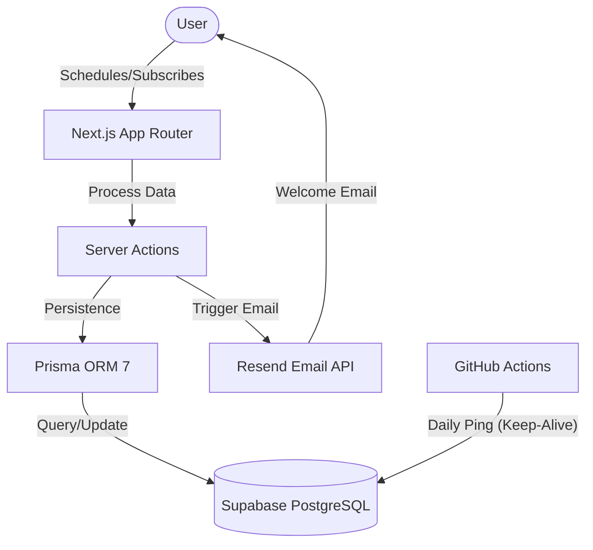

# 🎓 Memento Academy

A premium educational platform dedicated to Cryptocurrencies, NFTs, and Trading. This platform is engineered for high performance and visual excellence, leveraging modern full-stack technologies to deliver a seamless user experience.

## 🏗️ System Architecture

The application follows a modern serverless architecture with a focus on type safety and automated background processes.



## 🛠️ Technology Stack

- **Frontend**: [Next.js 15](https://nextjs.org/) (App Router), [React 19](https://react.dev/), [Tailwind CSS](https://tailwindcss.com/)
- **Interactions**: [Radix UI](https://www.radix-ui.com/), [Lucide React](https://lucide.dev/), [Framer Motion](https://www.framer.com/motion/)
- **Data & Persistence**: [Supabase](https://supabase.com/) (PostgreSQL), [Prisma 7](https://www.prisma.io/)
- **Communications**: [Resend](https://resend.com/)
- **DevOps**: [GitHub Actions](https://github.com/features/actions) for DB health maintenance

## 🚀 Key Features

### 1. High-Performance Newsletter System
Built with **Next.js Server Actions** for secure, low-latency processing.
- **Data Validation**: Real-time email validation and duplicate checking.
- **Preference Engine**: Personalized content delivery based on user interests.
- **Automated Onboarding**: Instant welcome sequences triggered via the Resend API.

### 2. Premium Design System
Fully responsive interface designed with a focus on dark-mode aesthetics and fluid micro-interactions.
- **Adaptive Theming**: Seamless switching between Dark and Light modes.
- **Dynamic Feedback**: Real-time status updates for user interactions.

### 3. Automated Database Health
Custom **GitHub Actions** workflows ensure the Supabase tier remains active by performing periodic health checks, preventing service pauses during inactivity.

## ⚙️ Project Setup

### Environment Configuration
Create a `.env.local` file with the following parameters:

```env
# Database Connection (Prisma 7 Style)
DATABASE_URL="your_supabase_pooler_url"
DIRECT_URL="your_supabase_direct_url"

# Service Keys
RESEND_API_KEY="re_..."
NEXT_PUBLIC_SUPABASE_URL="https://..."
NEXT_PUBLIC_SUPABASE_ANON_KEY="..."
```

### Essential Commands

```bash
# Install dependencies
npm install

# Generate Prisma Client (Required for type safety)
npx prisma generate

# Sync schema with database
npx prisma db pull

# Start development server
npm run dev
```

---
Built with precision for **Memento Academy**.
