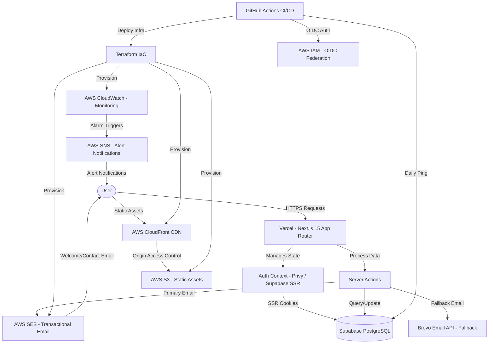

# Memento Academy

<div align="center">
    
    
    
    
    
    
    
    
</div>

<p align="center">
    <i>Free educational platform designed for Web3 newcomers. We simplify Cryptocurrencies, CBDCs, and Blockchain technology with zero costs for the community.</i>
</p>

## Educational Model

Memento Academy offers a structured learning path designed to take users from novices to Web3 experts.

### Course Types

#### 1. Free Courses (Foundation)

Designed for maximum accessibility and SEO.

- **Access**: Open to everyone (no login required to view).
- **Structure**: Fully dynamic content loaded from Supabase.
- **Progress**: Users who log in can track their progress and earn badges. Non-logged users see all content unlocked.
- **Current Courses**: `web3-basics`, `crypto-101`, `blockchain-dev`, `cbdc`.

#### 2. Premium Courses (Specialized)

Advanced content with strict progression.

- **Access**: Requires login (and future subscription).
- **Locking**: content is strictly sequential; you must complete Section 1 to unlock Section 2.
- **Deep Dives**: `defi-deep-dive`, `nft-masterclass`, `smart-contracts-101`, `portfolio-management`.

### Learning Structure

- **Modular Design**: Each course consists of **6-9 sections**.
- **Dynamic Engine**: Content is stored in SQL/JSON, allowing instant updates without redeploying the app.
- **Interactive Quizzes**: Embedded quizzes with instant feedback at the end of each section.
- **Progress Persistence**:
  - **Logged Users**: Synchronized across devices via Supabase.
  - **Guest Users**: Local progress saving via `localStorage` (device-specific).

---

## Achievements & Badges

The platform features a gamified progression system to encourage consistent learning. Badges are displayed on the User Dashboard.

### Badge Collection

There are currently **8 unique badges** available across 4 rarity tiers:

#### Common (Entry Level)

- **First Steps**: Complete your very first course section.
- **Course Graduate**: Complete any full course (100%).

#### Rare (Consistent Effort)

- **Speed Learner**: Complete a full course in under 24 hours.
- **Dedicated Student**: Complete 5 different courses.

#### Epic (Mastery)

- **DeFi Master**: Complete all DeFi-related courses.
- **Perfect Score**: Achieve 100% on a course final assessment.
- **Knowledge Seeker**: Complete a total of 50 sections across the platform.

#### Legendary (Elite)

- **Crypto Expert**: Complete 10 courses to prove ultimate mastery.

---

## Quiz Gamification

An interactive **Crypto Quiz Challenge** where users test their Web3 knowledge and earn real **MEMO tokens** on the Ethereum Sepolia testnet.

### Game Modes

| Mode                | Description                                                                           |
| ------------------- | ------------------------------------------------------------------------------------- |
| **Classic**         | 10 questions with progressive difficulty (Easy > Hard). Category selection available. |
| **Survival**        | Unlimited questions with 3 lives. How far can you go?                                 |
| **Daily Challenge** | _(Coming Soon)_ Random category with 2x rewards.                                      |

### Reward System

- **MEMO Token**: ERC-20 token distributed on Sepolia testnet
- **Earning Criteria**: Score 8/10 or higher to earn tokens
- **Speed Bonus**: +50% for answers under 3s, +25% under 5s
- **Streak Multiplier**: 1.5x at 3+ streak, 2x at 5+ streak

### Player Progression

| Rank       | Total Score Required |
| ---------- | -------------------- |
| Novato     | 0+                   |
| Aprendiz   | 100+                 |
| Experto    | 500+                 |
| Maestro    | 2,000+               |
| Leyenda    | 10,000+              |

### Leaderboard

- **Mode-Specific Rankings**: Separate leaderboards for Classic and Survival modes
- **Metrics Tracked**: Best score, total score, games played
- **Top 100**: Public leaderboard showcasing top performers

---

## User Dashboard

The dashboard provides a personalized learning hub with gamification elements to encourage consistent learning.

### Dashboard Components

```
+-----------------------------------------------------+
|  HERO: Continue Learning (Last accessed course)      |
|  [Progress: Section 3/8 - 42%] [Continue Button]    |
+-----------------------------------------------------+

+---------------+---------------+---------------+---------------+
|  XP           |  Streak       |  Level        |  Completed    |
|  1340         |  3 Days       |  2 (Learner)  |  34%          |
+---------------+---------------+---------------+---------------+
```

### Gamification System

#### XP (Experience Points)

- **Calculation**: `progress_percentage x 10` per course
- **Example**: A course at 50% = 500 XP, completed course (100%) = 1000 XP
- Total XP is the sum across all enrolled courses

#### Levels

| Level | Name       | XP Required |
| ----- | ---------- | ----------- |
| 1     | Explorer   | 0 - 999     |
| 2     | Learner    | 1,000+      |
| 3     | Specialist | 2,000+      |
| 4     | Expert     | 3,000+      |
| 5     | Master     | 4,000+      |

#### Streak

- Tracks consecutive days with learning activity
- Currently mocked at 3 days (real implementation requires activity log table)

#### Completion Percentage

- **Formula**: `(sum of all course progress) / (number of enrolled courses)`
- Shows overall learning progress across enrolled courses only

---

## System Architecture

The application follows a hybrid cloud architecture: **Vercel** handles the Next.js frontend and API routes (optimal for SSR/ISR), while **AWS** provides the infrastructure layer for CDN, email, and monitoring. All AWS resources are managed as Infrastructure as Code with **Terraform**.



## Technology Stack

- **Frontend**: [Next.js 15](https://nextjs.org/) (App Router), [React 19](https://react.dev/), [Tailwind CSS](https://tailwindcss.com/)
- **Interactions**: [Radix UI](https://www.radix-ui.com/), [Lucide React](https://lucide.dev/), [Framer Motion](https://www.framer.com/motion/)
- **Database**: [Supabase](https://supabase.com/) (PostgreSQL) with direct SQL and Server Actions
- **Authentication**: [Privy](https://www.privy.io/) (Web3 + Social Login), [Supabase SSR](https://supabase.com/docs/guides/auth/server-side) (Session Management)
- **Cloud Infrastructure**: [AWS Free Tier](https://aws.amazon.com/free/) (S3, CloudFront, SES, CloudWatch, SNS, IAM)
- **Infrastructure as Code**: [Terraform](https://www.terraform.io/) with remote state (S3 + DynamoDB)
- **CI/CD**: [GitHub Actions](https://github.com/features/actions) with OIDC authentication (keyless AWS access)
- **Communications**: [AWS SES](https://aws.amazon.com/ses/) (primary), [Brevo](https://www.brevo.com/) (fallback)
- **Web3**: [Ethers.js](https://ethers.org/), MEMO Token (ERC-20 on Sepolia)

## Key Features

### 1. Robust Authentication

- **Hybrid System**: Uses `@supabase/ssr` with **httpOnly cookies** for secure Server-Side Rendering (SSR) in Next.js 15.
- **Web3 Login**: Privy integration supporting wallet connection and social login.
- **Client Sync**: `createBrowserClient` ensures the client-side state stays in sync with server sessions.
- **Middleware**: Automatic session refreshing to prevent stale tokens.

### 2. Dynamic Content Engine

- **SQL-Driven**: Course content is decoupled from code, stored in `course_sections` table with JSONB for rich text and components.
- **Localization**: Native JSON support for `en` and `es` content within the same database row.
- **Performance**: Fetched via Server Components for optimal LCP.

### 3. AWS Infrastructure (Free Tier)

Production-grade cloud infrastructure managed entirely with Terraform.

- **S3 + CloudFront**: Global CDN for static assets with Origin Access Control (no public bucket access).
- **SES**: Transactional email with DKIM domain verification and HTML templates.
- **CloudWatch**: Monitoring dashboard with alarms for 5xx errors, S3 storage, and SES bounce rates.
- **SNS**: Email notifications triggered by CloudWatch alarms.
- **IAM with OIDC**: GitHub Actions authenticates to AWS via federation, eliminating static credentials.
- **Security**: Least-privilege IAM policies, encrypted state, versioned buckets, blocked public access.

### 4. High-Performance Newsletter System

Built with **Next.js Server Actions** for secure, low-latency processing.

- **Data Validation**: Real-time email validation and duplicate checking.
- **Preference Engine**: Personalized content delivery based on user interests.

### 5. Premium Design System

Fully responsive interface designed with a focus on dark-mode aesthetics.

- **Adaptive Theming**: Seamless switching between Dark and Light modes.
- **Glassmorphism**: Modern UI elements with blurred backdrops.

### 6. Automated Infrastructure & Database Health

- **Terraform CI/CD**: Infrastructure plan on PRs, auto-deploy on merge to main.
- **Keep-Alive Workflows**: GitHub Actions ensuring Supabase free tier stays active.
- **AWS Health Checks**: Automated monitoring of CloudFront, S3, and SES services.

## Testing Strategy

The project implements a robust automated testing strategy using **Jest** and **React Testing Library**.

### Test Coverage

#### 1. Frontend Unit Tests

- **AuthModal**: Login/signup form rendering and validation.
- **BadgeGrid**: Visual distinction between earned/locked badges.

#### 2. Backend Integration Tests

- **Newsletter Action**: Verify duplicate handling.
- **Contact API**: Tests API route flow and rate limiting.

### Security & Validation

- **Zod**: Strict input validation for all forms and APIs.
- **SQL Injection**: Prevented via parameterized queries and ORM.
- **XSS**: Automatic escaping in React components.

Run the full suite with:

```bash
npm run test
```

## Localization Workflow

The platform supports full internationalization (i18n) for **English** and **Spanish**, using a hybrid approach of static dictionaries and dynamic routing.

### Structure

- **Routing**: Creating a directory structure `app/[lng]/` where `lng` can be `en` or `es`.
- **Content**:
  - **Component UI**: Uses `translations` objects directly within components for small UI text.
  - **Static Data**: Large content (courses, achievements) is split into separate files (e.g., `courses-data.ts` vs `courses-data-es.ts`).
  - **Client-Side**: Hooks like `useParams` detect the language and serve the correct content instantly.

### Adding New Content

1. **Create the component**: Build the UI structure.
2. **Define translations**: Create an internal `translations` object with `en` and `es` keys.
3. **Propagate `lng`**: Ensure the `lng` prop is passed down from the page level to all child components.
4. **Data Files**: If adding a new course, update both `lib/courses-data.ts` and `lib/courses-data-es.ts`.

## Project Setup

### Environment Configuration

Create a `.env.local` file with the following parameters:

```env
# Database Connection
DATABASE_URL="your_supabase_pooler_url"
DIRECT_URL="your_supabase_direct_url"

# Service Keys
BREVO_API_KEY="xkeysib-..."
NEXT_PUBLIC_SUPABASE_URL="https://..."
NEXT_PUBLIC_SUPABASE_ANON_KEY="..."

# AWS (optional - set via aws configure)
NEXT_PUBLIC_CDN_URL="https://your-cloudfront-domain.cloudfront.net"
```

### Essential Commands

```bash
# Install dependencies
npm install

# Start development server
npm run dev

# Run tests
npm run test
```

### AWS Infrastructure Setup

```bash
# 1. Configure AWS CLI
aws configure

# 2. Bootstrap Terraform state (run once)
# Windows: run commands from infrastructure/scripts/bootstrap.sh manually
# Linux/Mac: bash infrastructure/scripts/bootstrap.sh

# 3. Configure variables
cp infrastructure/terraform/environments/prod.tfvars.example \
   infrastructure/terraform/environments/prod.tfvars
# Edit prod.tfvars with your values

# 4. Deploy infrastructure
cd infrastructure/terraform
terraform init
terraform apply -var-file=environments/prod.tfvars
```

See [docs/aws-architecture.md](docs/aws-architecture.md) for full architecture documentation.

---

Built with precision for **Memento Academy**.
